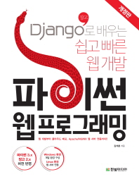

# 장고로 개발하는 쉽고 빠른 웹 개발 (빨간책)
  
### Chapter 1. 웹 프로그래밍의 이해
- 1. 웹 프로그래밍이란?
- 2. 다양한 웹 클라이언트
- 3. HTTP 프로토콜
- 4. URL 설계
- 5. 웹 애플리케이션 서버
    
 

### Chapter 2. 파이썬 웹 표준 라이브러리
- 1. 웹 라이브러리 구성
- 2. 웹 클라이언트 라이브러리
- 3. 웹 서버 라이브러리
- 4. CGI/WSGI 라이브러리
    
 

### Chapter 3. Django 웹 프레임워크
- 1. 일반적인 특징
- 2. 장고 프로그램 설치
- 3. 장고에서의 애플리케이션 개발 방식
- 4. 애플리케이션 설계하기
- 5. 프로젝트 뼈대 만들기
- 6. 애플리케이션 개발하기 - Model 코딩
- 7. 애플리케이션 개발하기 - View 및 Template 코딩
  
 

### Chapter 4. Django의 핵심 기능
- 1. Admin 사이트 꾸미기
- 2. 장고 파이썬 쉘로 데이터 조작하기
- 3. 템플릿 시스템
- 4. 폼 처리하기
- 5. 클래스형 뷰
- 6. 로그 남기기
  
 

### Chapter 5. 실습 예제 확장하기
- 1. 새로운 애플리케이션 만들기
- 2. 프로젝트 첫 페이지 만들기
- 3. polls 애플리케이션 ? 클래스형 뷰로 변경하기
  
 

### Chapter 6. 스프링 부트 화면 개발
- 1. 장고의 wsgi.py 파일
- 2. 장고의 WSGI 인터페이스
- 3. 운영 서버 적용 전 장고의 설정 변경 사항
  
 

### Chapter 7. Cloud 서버에 Django 배포하기
- 1. PythonAnywhere 사이트에 가입하기
- 2. 장고 소스 가져오기
- 3. 리눅스 명령으로 압축 풀기
- 4. 가상 환경 만들기
- 5. PythonAnywhere 서버에서 장고 설정 변경하기
- 6. PythonAnywhere 웹 서버 설정하기
- 7. 지금까지 작업 확인하기
  
 

### Chapter 8. Apache 웹 서버와 연동
- 1. 장고 설정 변경
- 2. modwsgi 확장 모듈
- 3. modwsgi 설치
- 4. 내장 모드로 실행
- 5. 데몬 모드로 실행
  
 

### Chapter 9. NGINX 웹 서버와 연동
- 1. 장고 설정 변경하기
- 2. NGINX 설치
- 3. NGINX 설정
- 4. uWSGI 설치
- 5. uWSGI 설정
- 6. 지금까지 작업 확인하기
  
 

### Appendix A. 외부 라이브러리 requests, beautifulsoup4 맛보기
- 1. 외부 라이브러리 설치
- 2. urllib.request 모듈 예제 재작성
- 3. http.client 모듈 예제 재작성
  
 

### Appendix B. 장고의 데이터베이스 연동
- 1. MySQL 데이터베이스 연동
- 2. PostgreSQL 데이터베이스 연동
- 3. Oracle 데이터베이스 연동
  
 

### Appendix B. 장고의 데이터베이스 연동
- 1. MySQL 데이터베이스 연동
- 2. PostgreSQL 데이터베이스 연동
- 3. Oracle 데이터베이스 연동
  
 

### Appendix C. HTTP 상태 코드 전체 
  
 

### Appendix D. PyCharm 무료 버전 사용하기
- 1. PyCharm Community Edition 설치하기
- 2. PyCharm 초기 설정하기
- 3. 파이썬 가상 환경 구성하기
- 4. Django 패키지 설치하기
- 5. 터미널 창에서 Django 프로젝트 뼈대 만들기
- 6. 테스트를 위한 runserver 실행하기
- 7. 외부 프로젝트를 임포트해 사용하기
- 8. 임포트한 프로젝트 runserver 실행하기

